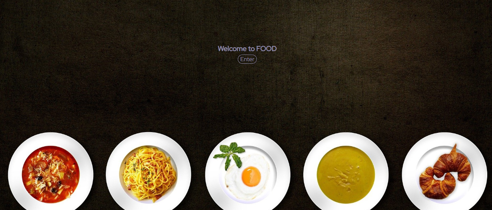
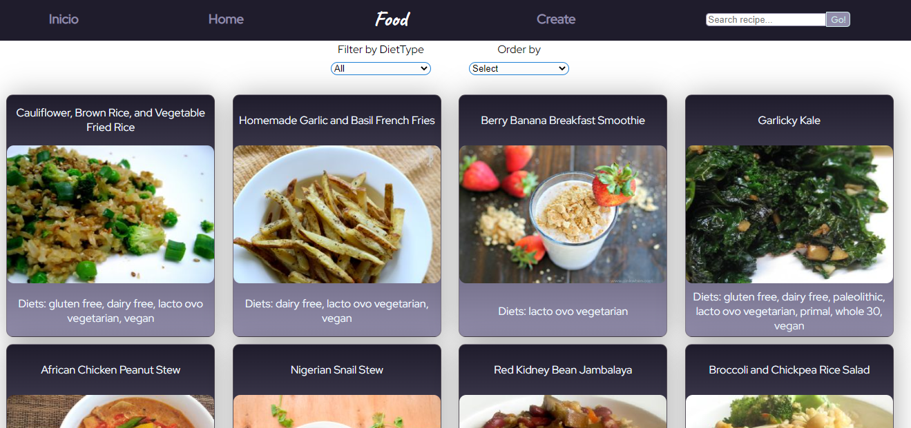
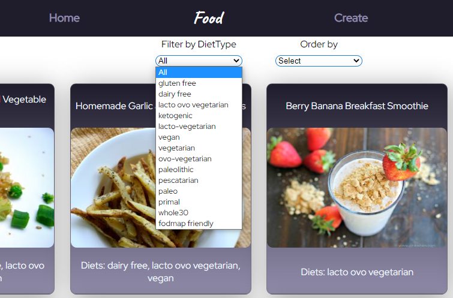
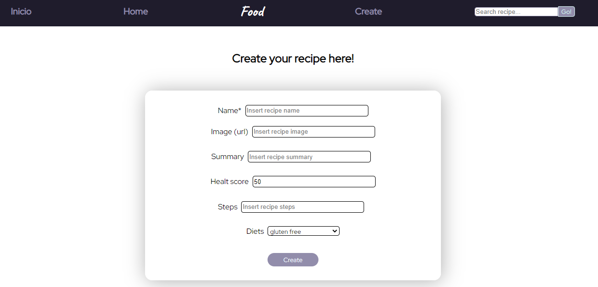

<h1 align="center">Individual Project - Food 🍕💻</h1>

<h3 align="center">Proyecto individual final realizado por Julián Soto para el bootcamp Soy Henry! 🚀 🙂 </h3>

<h3 align="center">Landing Page! 📣</h3>
<p align="center">
  
</p>
<h3 align="center">Home! 👨‍🚀</h3>
<p align="center">
  
</p>
<h3 align="center">Filtros! 🤘</h3>
<p align="center">
  
</p>
<h3 align="center">Crear nueva receta! ✍️</h3>
<p align="center">
  
</p>

## Objetivos del Proyecto

- Construir una App utlizando React, Redux, Node y Sequelize.
- Afirmar y conectar los conceptos aprendidos en la carrera.
- Aprender mejores prácticas.
- Aprender y practicar el workflow de GIT.
- Usar y practicar testing.

## Horarios y Fechas

El proyecto tendrá una duración máxima de tres semanas. En el caso de que completan todas las tareas antes de dicho lapso podrán avisar a su Instructor para coordinar una fecha de presentación del trabajo (DEMO).

## Comenzando

1.  Forkear el repositorio para tener una copia del mismo en sus cuentas
2.  Clonar el repositorio en sus computadoras para comenzar a trabajar

Tendrán un `boilerplate` con la estructura general tanto del servidor como de cliente.

**IMPORTANTE:** Es necesario contar minimamente con la última versión estable de Node y NPM. Asegurarse de contar con ella para poder instalar correctamente las dependecias necesarias para correr el proyecto.

Actualmente las versiónes necesarias son:

- **Node**: 12.18.3 o mayor
- **NPM**: 6.14.16 o mayor

Para verificar que versión tienen instalada:

```bash
node -v
npm -v
```

**ACLARACIÓN:** Las dependencias actuales se encuentran en las versiones que venimos trabajando durante el bootcamp.

Versiones:

- **react**: 17.0.1
- **react-dom**: 17.0.1
- **react-router-dom**: 5.2.0
- **redux**: 4.0.5
- **react-redux**: 7.2.3

Está permitido, **bajo su responsabilidad**, actualizar las dependencias a versiones más actuales.

> **IMPORTANTE:** Versiones mas actuales podrían presentar configuraciones diferentes respecto a las versiones en las que venimos trabajando durante el bootcamp.

## BoilerPlate

El boilerplate cuenta con dos carpetas: `api` y `client`. En estas carpetas estará el código del back-end y el front-end respectivamente.

En `api` crear un archivo llamado: `.env` que tenga la siguiente forma:

```env
DB_USER=usuariodepostgres
DB_PASSWORD=passwordDePostgres
DB_HOST=localhost
```

Reemplazar `usuariodepostgres` y `passwordDePostgres` con tus propias credenciales para conectarte a postgres. Este archivo va ser ignorado en la subida a github, ya que contiene información sensible (las credenciales).

Adicionalmente será necesario que creen desde psql una base de datos llamada `food`

El contenido de `client` fue creado usando: Create React App.

## Enunciado

La idea general es crear una aplicación en la cual se puedan ver distintas recetas de comida junto con información relevante de las mismas utilizando la api externa [spoonacular](https://spoonacular.com/food-api) y a partir de ella poder, entre otras cosas:

- Buscar recetas
- Filtrarlos / Ordenarlos
- Crear nuevas recetas propias

**IMPORTANTE**: Para poder utilizar esta API externa es necesario crearse una cuenta para obtener una API Key que luego debera ser incluida en todos los request que hagamos a spoonacular simplemente agregando `?apiKey={YOUR_API_KEY}` al final de cada endpoint. Agregar la clave en el archivo `.env` para que la misma no se suba al repositorio por cuestiones de seguridad y utilizarla desde allí. Por otro lado tienen un límite de requests por día por lo que usenlos con cuidado!

**IMPORTANTE**: Para las funcionalidades de filtrado y ordenamiento NO pueden utilizar los endpoints de la API externa que ya devuelven los resultados filtrados u ordenados sino que deben realizarlo ustedes mismos. En particular alguno de los ordenamientos o filtrados debe si o si realizarse desde el frontend.

### Únicos Endpoints/Flags que pueden utilizar

- GET <https://api.spoonacular.com/recipes/complexSearch>
  - Para obtener mayor información sobre las recetas, como por ejemplo el tipo de dieta deben agregar el flag `&addRecipeInformation=true` a este endpoint
  - Para los tipos de dieta deben tener en cuenta las propiedades vegetarian, vegan, glutenFree por un lado y también analizar las que se incluyan dentro de la propiedad `diets`
- GET <https://api.spoonacular.com/recipes/{id}/information>

### Requerimientos mínimos

A continuación se detallaran los requerimientos mínimos para la aprobación del proyecto individial. Aquellos que deseen agregar más funcionalidades podrán hacerlo. En cuanto al diseño visual no va a haber wireframes ni prototipos prefijados sino que tendrán libertad de hacerlo a su gusto pero tienen que aplicar los conocimientos de estilos vistos en el curso para que quede agradable a la vista.

**IMPORTANTE**: No se permitirá utilizar librerías externas para aplicar estilos a la aplicación. Tendrán que utilizar CSS con algunas de las opciones que vimos en dicha clase (CSS puro, CSS Modules o Styled Components)

#### Tecnologías necesarias

- [ ] React
- [ ] Redux
- [ ] Express
- [ ] Sequelize - Postgres

## Frontend

Se debe desarrollar una aplicación de React/Redux que contenga las siguientes pantallas/rutas.

**Pagina inicial**: deben armar una landing page con

- [ ] Alguna imagen de fondo representativa al proyecto
- [ ] Botón para ingresar al home (`Ruta principal`)

**Ruta principal**: debe contener

- [ ] Input de búsqueda para encontrar recetas por nombre
- [ ] Área donde se verá el listado de recetas. Deberá mostrar su:
  - Imagen
  - Nombre
  - Tipo de dieta (vegetariano, vegano, apto celíaco, etc)
- [ ] Botones/Opciones para filtrar por por tipo de dieta
- [ ] Botones/Opciones para ordenar tanto ascendentemente como descendentemente las recetas por orden alfabético y por health score (nivel de comida saludable).
- [ ] Paginado para ir buscando y mostrando las siguientes recetas, 9 recetas por pagina, mostrando las primeros 9 en la primer pagina.

**IMPORTANTE**: Dentro de la Ruta Principal se deben mostrar tanto las recetas traidas desde la API como así también las de la base de datos. Debido a que en la API existen alrededor de 5 mil recetas, por cuestiones de performance pueden tomar la simplificación de obtener y paginar las primeras 100.

**Ruta de detalle de receta**: debe contener

- [ ] Los campos mostrados en la ruta principal para cada receta (imagen, nombre, tipo de plato y tipo de dieta)
- [ ] Resumen del plato
- [ ] Nivel de "comida saludable" (health score)
- [ ] Paso a paso

**Ruta de creación de recetas**: debe contener

- [ ] Un formulario **controlado con JavaScript** con los siguientes campos:
  - Nombre
  - Resumen del plato
  - Nivel de "comida saludable" (health score)
  - Paso a paso
- [ ] Posibilidad de seleccionar/agregar uno o más tipos de dietas
- [ ] Botón/Opción para crear una nueva receta

> Es requisito que el formulario de creación esté validado con JavaScript y no sólo con validaciones HTML. Pueden agregar las validaciones que consideren. Por ejemplo: Que el nombre de la receta no pueda contener símbolos, que el health score no pueda exceder determinado valor, etc.

## Base de datos

El modelo de la base de datos deberá tener las siguientes entidades (Aquellas propiedades marcadas con asterisco deben ser obligatorias):

- [ ] Receta con las siguientes propiedades:
  - ID: \*
  - Nombre \*
  - Resumen del plato \*
  - Nivel de "comida saludable" (health score)
  - Paso a paso
- [ ] Tipo de dieta con las siguientes propiedades:
  - ID
  - Nombre

La relación entre ambas entidades debe ser de muchos a muchos ya que una receta puede ser parte de varios tipos de dieta en simultaneo y, a su vez, un tipo de dieta puede contener múltiples recetas distintas. Un ejemplo tomado de la API sería el `Strawberry Mango Green Tea Limeade` que es vegetariano, vegano y apto para celíacos, todo al mismo tiempo. Pero a su vez existen otras recetas para vegetarianos.

**IMPORTANTE**: Pensar como modelar los IDs de las recetas en la base de datos. Existen distintas formas correctas de hacerlo pero tener en cuenta que cuando hagamos click en alguna receta, esta puede provenir de la API o de la Base de Datos por lo que cuando muestre su detalle no debería haber ambigüedad en cual se debería mostrar. Por ejemplo si en la API la receta `Strawberry Mango Green Tea Limeade` tiene id = 1 y en nuestra base de datos creamos una nueva receta `Medialunas de Manteca` con id = 1, ver la forma de diferenciarlas cuando querramos acceder al detalle de la misma.

## Backend

Se debe desarrollar un servidor en Node/Express con las siguientes rutas:

**IMPORTANTE**: No está permitido utilizar los filtrados, ordenamientos y paginados brindados por la API externa, todas estas funcionalidades tienen que implementarlas ustedes.

- [ ] **GET /recipes?name="..."**:
  - Obtener un listado de las recetas que contengan la palabra ingresada como query parameter
  - Si no existe ninguna receta mostrar un mensaje adecuado
- [ ] **GET /recipes/{idReceta}**:
  - Obtener el detalle de una receta en particular
  - Debe traer solo los datos pedidos en la ruta de detalle de receta
  - Incluir los tipos de dieta asociados
- [ ] **POST /recipes**:
  - Recibe los datos recolectados desde el formulario controlado de la ruta de creación de recetas por body
  - Crea una receta en la base de datos relacionada con sus tipos de dietas.
- [ ] **GET /diets**:
  - Obtener todos los tipos de dieta posibles
  - En una primera instancia, cuando no exista ninguno, deberán precargar la base de datos con los tipos de datos indicados por spoonacular [acá](https://spoonacular.com/food-api/docs#Diets)

## Testing

- [ ] Al menos tener un componente del frontend con sus tests respectivos
- [ ] Al menos tener una ruta del backend con sus tests respectivos
- [ ] Al menos tener un modelo de la base de datos con sus tests respectivos
